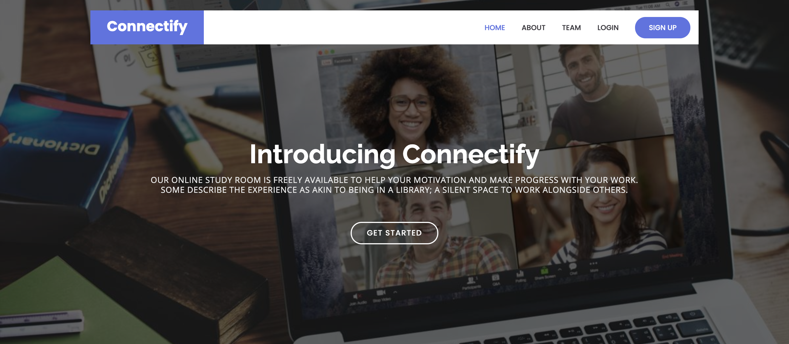

  

  <h3 align="center">Connectify</h3>
  

    Looking for company while Studying?
    Let Connectify handle it for you.
     
     
  <i> Our Online Study Room is freely available to help with your motivation and make progress with your work. 
<b>Some describe the experience as akin to being in a library; a silent place to work alongside others</b>
</i>
     
     
    We all become really busy with what can feel like the relentless demands of academic study and life. Many of us recognise the privilege we have to access education, but that is little comfort when we feel isolated and despondent. Connectify is built on the idea to decrease isolation and motivate us all not only to progress our work but know we can do so while our simple presence supports others. We are not alone.
   
    
    What is certain, is that one small action in the world has a definite ripple effect. So we all perhaps need to be more active.
 

<a href="https://github.com/vrushti-mody/connectify/issues">Report Bug</a>
    ·
    <a href="https://github.com/vrushti-mody/connectify/issues">Submit Feature</a>

  

 
<!-- TABLE OF CONTENTS -->

## Table of Contents

- [About the Project](#about-the-project)
  - [Set Up](https://github.com/vrushti-mody/Connectify/DEVELOPERS.md)
  - [Tips](#features)
  - [Contributors](#contributors)
- [Working Demo of the application](#video-demo)

## About The Project

Our room is open 24/7 (with short resets of a couple of minutes once every 40-48 hours). It is mostly unmoderated and unstructured. The space is your to make it work for you and your time zone.
<ul>
    <li>Tackle Lonliness</li>
    <li>Get Support and Encouragement</li>
    <li>Make New Friends</li>
    </ul>

### Tips

#### 1. Make Time to Plan

We know that a ‘virtual’ retreat comes with distractions. Perhaps for this event you will find a different place to work, rearrange your desk or put up a sign ‘Connectify Retreat’. Change your email auto response you are ‘out of the office’. Make a contract with yourself and with us to plan when you will and when you will not access the internet. To plan to succeed you need a plan. It doesn’t matter if you really know what is achievable or how this will work. Learning these things is all part of the experience. Sharing goals is important

#### 2. Follow a schedule

Ensure that you have times allotted in your day when you can work. Even if you are only going to enter the portal for one hour a day – maximise your work in that time. Sitting for four hours at your desk while surfing the net does not constitute work. Be clear on your goals – tell others in the portal what you aim to achieve; report back on what challenges you faced and how you overcame them.

### Contributors

- [Vrushti Mody](https://github.com/vrushti-mody)
- [Ahad Zai](https://github.com/AhadKhan98)
- [Julia Liu](https://github.com/juliasliu)

### [Video Demo]()

